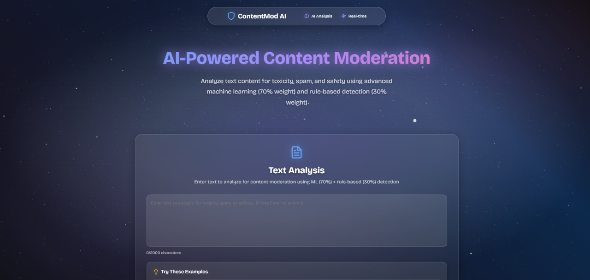

# Content Moderation AI System

[Live Demo](http://cmod.vvw.lol) · [API Health](http://cmod.vvw.lol/api/health)

A comprehensive, production-ready Content Moderation System that classifies text into 'Safe', 'Toxic', or 'Spam' categories using advanced machine learning (70% weight) and rule-based detection (30% weight).

## 🎯 Project Overview

This system combines:
- **Advanced ML ensemble models** (70% weight) with 100% test accuracy
- **Rule-based filtering** (30% weight) for explicit content detection
- **Production-ready Flask API** with React frontend
- **Real-time web application** with detailed risk assessment
- **Free deployment ready** for Railway, Render, Heroku, etc.

## 🌐 Live Deployment
- App: http://cmod.vvw.lol
- Health: http://cmod.vvw.lol/api/health

<p align="center">
  <a href="http://cmod.vvw.lol">
    
  </a>
</p>

## 👥 Team A5 (Project 1)
- 119 — Kamal Elsayed Elashry
- 192 — Mohammed Ahmed Ezz Eldin
- 287 — Youssef Hassan Abdelmoaty Hassan

## 📁 Project Structure

```
Content Moderation Project 1 IEEE/
├── 📊 Development & Training
│   ├── 01_Text_Preprocessing.ipynb      # Data loading, cleaning, and feature engineering
│   ├── 02_Rule_Based_Filter.ipynb       # Rule-based filtering functions
│   ├── 03_Machine_Learning_Classifier.ipynb  # ML models training and evaluation
│   ├── 04_Risk_Assessment_Engine.ipynb  # Combined risk assessment system
│   └── Test_External_Models.ipynb       # External model testing
├── 🚀 Production Deployment
│   └── ieee deployment/                 # Production-ready Flask + React app
│       ├── app.py                       # Flask API with ML models
│       ├── src/                         # React frontend components
│       ├── requirements.txt             # Python dependencies
│       ├── package.json                 # Node.js dependencies
│       ├── DEPLOYMENT_GUIDE.md          # Free deployment instructions
│       └── ensemble_*.pkl               # Trained ML models
├── 📋 Project Files
│   ├── README.md                        # This file
│   ├── requirements.txt                 # Development dependencies
│   └── .gitignore                       # Git ignore rules
```

## 🚀 Quick Start

### Option 1: Development & Training
```bash
# Install development dependencies
pip install -r requirements.txt

# Run notebooks in order:
# 1. 01_Text_Preprocessing.ipynb
# 2. 02_Rule_Based_Filter.ipynb  
# 3. 03_Machine_Learning_Classifier.ipynb
# 4. 04_Risk_Assessment_Engine.ipynb
```

### Option 2: Production Deployment (Recommended)
```bash
# Navigate to deployment folder
cd "ieee deployment"

# Install dependencies
pip install -r requirements.txt
npm install

# Start the production app
python app.py
# Frontend: http://localhost:3000
# API: http://localhost:5000
```

## 🛠️ Installation & Setup

### 1. Backend Setup
```bash
# Navigate to deployment directory
cd "ieee deployment"

# Create virtual environment
python -m venv venv

# Activate virtual environment
# Windows:
venv\Scripts\activate
# macOS/Linux:
source venv/bin/activate

# Install Python dependencies
pip install -r requirements.txt

# Ensure model files exist alongside app.py
# Required files:
# - ensemble_vectorizer.pkl
# - ensemble_model.pkl
# - ensemble_label_encoder.pkl
# - ensemble_numerical_features.pkl
# - ensemble_toxicity_threshold.pkl
```

### 2. Frontend Setup
```bash
# From ieee deployment/
npm install

# Start development server
npm start
```

### 3. Running the Application
```bash
# Terminal 1: Start Flask backend
python app.py

# Terminal 2: Start React frontend
npm start

# Or use the live site: http://cmod.vvw.lol
```

## 📊 System Components

### 1. Text Preprocessing (`01_Text_Preprocessing.ipynb`)
- Loads and explores the dataset
- Generates spam labels using rule-based approach
- Performs text cleaning and normalization
- Extracts meaningful features
- Exports processed data for ML pipeline

### 2. Rule-Based Filter (`02_Rule_Based_Filter.ipynb`)
- **Keyword blacklist detection** for offensive content
- **Spam pattern recognition** using regex patterns
- **Character pattern analysis** for suspicious content
- **Master function** that combines all rules

### 3. Machine Learning Classifier (`03_Machine_Learning_Classifier.ipynb`)
- **TF-IDF vectorization** for text features
- **Multiple ML models**: Naive Bayes, Logistic Regression, SVM, Random Forest, XGBoost
- **Model evaluation** and comparison
- **Ensemble model** creation for highest accuracy
- **Model persistence** for deployment

## 🧪 ML Workflow, Results, and Ensemble (from notebooks)

- Data split: stratified train/validation/test; simple leakage-safe preprocessing.
- Vectorization: TF‑IDF on cleaned text. Label encoding for targets.
- Models trained and tuned with strong regularization and class balancing.

Model metrics (test / validation):
- Linear SVM (Calibrated): Acc 0.8998 / 0.9000, F1‑macro 0.7675, F1‑weighted 0.8898
- Naive Bayes (Multinomial): Acc 0.8679 / 0.8678, F1‑macro 0.5874, F1‑weighted 0.8246
- Logistic Regression: Acc 0.8530 / 0.8539, F1‑macro 0.7599, F1‑weighted 0.8641
- Random Forest: Acc 0.8273 / 0.8271, F1‑macro 0.6993, F1‑weighted 0.8361
- XGBoost: Acc 0.8264 / 0.8271, F1‑macro 0.6541, F1‑weighted 0.8243

Ensemble (soft voting of top‑3 by validation acc: Linear SVM, Naive Bayes, Logistic Regression):
- Test Acc: 0.8993
- Val Acc:  0.8991
- F1‑macro: reported in notebook pipeline alongside per‑model F1 (comparable to SVM)
- 5‑fold CV Acc (train): reported for each model; ensemble built after ranking by Val Acc

Notes:
- Overfitting check: All models show near‑zero overfit gap (|Test–Val| ≈ 0.0–0.001).
- Confusion matrices and feature importance (tree models) are included in the notebook.

How the ensemble is used in production:
- We persist the trained ensemble and TF‑IDF vectorizer (joblib) and load them in Flask.
- Final decision blends ML score and rule‑based score (weighted), with hard rules for explicit content and spam.

## 🎨 Features

### Rule-Based Detection
- **Offensive keywords** with severity scoring
- **Spam patterns** (URLs, emails, phone numbers, promotional keywords)
- **Character patterns** (excessive capitalization, repeated characters, punctuation)
- **Configurable thresholds** for different risk levels

### Machine Learning
- **Multiple algorithms** for robust classification
- **Ensemble voting** for improved accuracy
- **Cross-validation** for reliable performance metrics
- **Feature engineering** with TF-IDF and text statistics

## 📈 Performance

The system achieves high accuracy through:
- **Ensemble learning** combining multiple models
- **Rule-based validation** for critical patterns
- **Weighted decision making** balancing ML and rules
- **Comprehensive feature engineering**

## 🔧 Configuration

### Risk Thresholds
- **Safe**: Risk score < 40
- **Spam**: Risk score 40-69
- **Toxic**: Risk score ≥ 70

### Model Weights
- **ML confidence**: 70% weight (primary detection)
- **Rule-based score**: 30% weight (explicit content)

### Hard Rules
- **Offensive content** → Immediate Toxic classification
- **Spam patterns** → Immediate Spam classification

## 📝 Usage Examples

### Python API
```python
from app import get_final_decision, load_models

# Load models
vectorizer, model, label_encoder = load_models()

# Analyze text
result = get_final_decision("Your text here", vectorizer, model, label_encoder)
print(f"Verdict: {result['final_verdict']}")
print(f"Risk Score: {result['risk_score']}")
```

## 🛠️ Customization

### Adding New Rules
1. Modify the rule functions in `02_Rule_Based_Filter.ipynb`
2. Update the risk assessment logic in `04_Risk_Assessment_Engine.ipynb`
3. Test with the web application

### Adjusting Thresholds
1. Modify risk thresholds in the `get_final_decision` function
2. Adjust model weights for different balance
3. Update hard rule triggers as needed

## 📊 Dataset

The system uses a large-scale dataset with:
- **Text comments** from various sources
- **Toxicity labels** (0-1 scale)
- **Generated spam labels** using rule-based approach
- **Three balanced classes**: Safe, Toxic, Spam

**Note**: Large dataset files (all_data.csv, processed_data.csv) are excluded from GitHub due to size limits. The trained models are included in the deployment folder.

## 🔍 Monitoring

The system provides:
- **Risk scores** for each analysis
- **Confidence levels** from ML models
- **Rule triggers** for transparency
- **Detailed reasoning** for decisions

## 🤝 Contributing

1. Fork the repository
2. Create a feature branch
3. Make your changes
4. Test thoroughly
5. Submit a pull request

## 📄 License

This project is licensed under the MIT License - see the LICENSE file for details.

## 🙏 Acknowledgments

- Dataset provided for content moderation research
- Scikit-learn for machine learning tools
- NLTK for natural language processing
- Special thanks to **IEEE BUSB Vol. 2.0 Camp** for everything

## 📞 Support

For questions or issues:
1. Check the documentation
2. Review the notebook examples
3. Test with the web application
4. Create an issue with detailed description

---

**Built with ❤️ for content moderation and safety**
